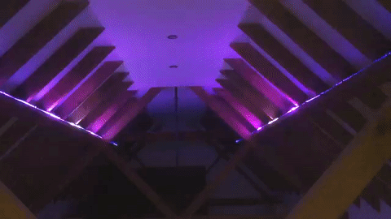
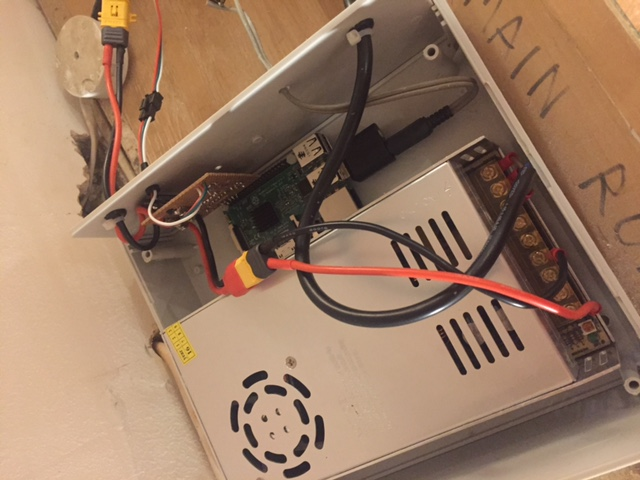

Visualization Skill
===================

A fun project to control twin 5m RGB LED strips from an Amazon Echo. An audio feed from the Echo provides input to
visualization software on a Raspberry Pi which drives the 10 metres of LED strips.


Separately, an Alexa skill takes voice commands from the Echo, translates those into commands using an
AWS Lambda function and sends the resulting commands down an AWS IoT MQTT queue to the Raspberry Pi.
The Raspberry Pi running the music visualization software also subscribes to the MQTT IoT queue to 
receive commands and update the visualization effect.



## Software

[Music Visualization](https://github.com/scottlawsonbc/audio-reactive-led-strip) library, enhanced to support 
connecting to AWS IoT and receiving commands:

```python
    def callback(client, userdata, message):
        global visualization_effect

        payloadDict = json.loads(message.payload)
        if payloadDict["message"] == "scroll":
            visualization_effect = visualize_scroll
        if payloadDict["message"] == "spectrum":
            visualization_effect = visualize_spectrum
        if payloadDict["message"] == "energy":
            visualization_effect = visualize_energy


    myMQTTClient = AWSIoTMQTTClient("ReactiveLeds")
    myMQTTClient.configureEndpoint("a2wkex2gd7mljx.iot.eu-west-1.amazonaws.com", 8883)
    myMQTTClient.configureCredentials("root-CA.crt", "ReactiveLeds.private.key", "ReactiveLeds.cert.pem")
    myMQTTClient.connect()
    myMQTTClient.subscribe("commands", 1, callback)
```

All other software can be found in the [AWS CloudFormation template](../iot.yaml)

## Hardware

The finished project, enclosed in a nice case to protect the mains voltage terminals.
This photo shows the stripboard Raspberry Pi3 "daughterboard" using 90 degree angle headers. The stripboard
contains the 1000uF smoothing capacitor across the 5V power rails, a [74AHCT125 level shifter](https://www.adafruit.com/product/1787) to shift the 
3.3V signal output up to 5V, and an inline resistor on the signal wire.

Additionally, a single ws2812b pixel was soldered to the stripboard to act as a signal cleaner. Without this, the twin 5m LED strips which are 4m of cable away get a
corrupted signal resulting in unpleasant noise. 



With the case closed, the signal cleaning WS2812b pixel is visible through the endplate.


The resulting effect:

[](https://www.youtube.com/watch?v=lj1yhpyGnT4)

### Parts list

* Raspberry Pi 3
* USB Analog to Digital converter (3.5mm stereo audio input)
* 1000uF capacitor
* 300ohm resistor
* 14 AWG silicone cable
* 218x237x93MM Large Project Box Vented Enclosure
* KeerSen DC 5V 60A 300W Switching Power Supply Regulated Transformer
* XT60 connectors
* 74AHCT125 level shifter
* Twin 5m RGB ws2812b LED strip 60 pixels/m
* 3pin JST SM connectors
* 3.5mm stereo male to female panel mount

